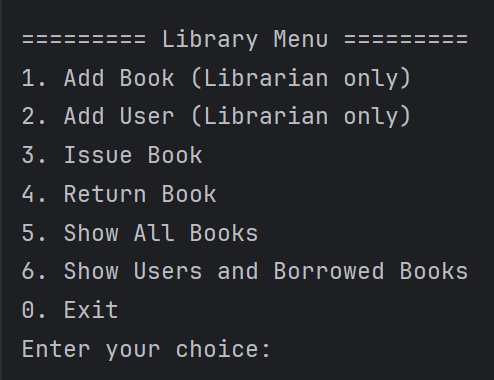
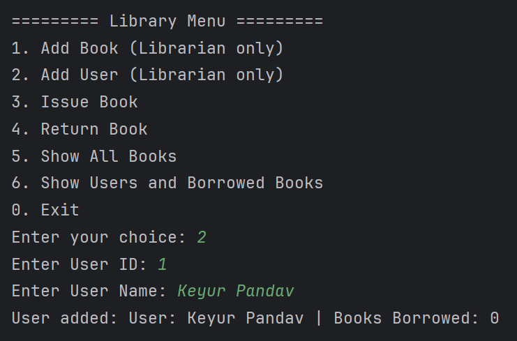
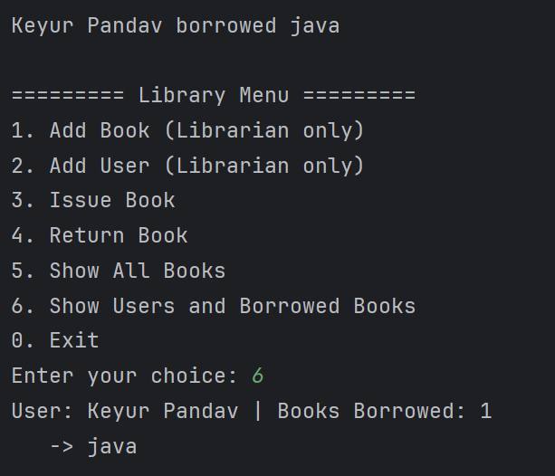

# 📚 Library Management System (Java OOP)

## 🚀 Overview
This is a **Java-based console application** that simulates a **Library Management System** using **Object-Oriented Programming (OOP)** principles.

It allows:
- **Librarian** to add books and users.
- **Users** to issue and return books.
- Track **book quantity** and **borrowed books per user**.
- View all books and users with their borrowed books.

The system is fully **menu-driven** using `switch-case`, so the user chooses operations interactively.

---

## 🛠️ Features

### 👨‍🏫 Librarian Features
- Add new **books** with `id, title, author, quantity`.
- Add new **users** with `id, name`.

### 👤 User Features
- Borrow a book (only if available).
- Return a borrowed book.
- Cannot borrow a book if not registered.

### 📊 Tracking
- Keeps track of **book quantity**.
- Shows **how many books are available**.
- Shows **how many books each user has borrowed**.

---

## ⚙️ OOP Concepts Used
- **Encapsulation** → private fields (`Book`, `User`) with getters & setters.
- **Abstraction** → `Library` provides only required methods (`addBook`, `issueBook`, etc.).
- **Inheritance** → Not heavily used, but Librarian and User can be extended for roles.
- **Polymorphism** → Overridden `toString()` methods in `Book`, `User`, `Librarian`.
- **Association (HAS-A)** →  
  - `Library HAS-A List<Book>`  
  - `User HAS-A List<Book>`  

---

## 🔍 Screenshots

📸 Replace these with your own program screenshots (upload them in a `Screenshots/` folder in your repo):

  
  
  
  

---

## 📌 How to Run

1. Clone this repository:
   ```bash
   [git clone https://github.com/your-username/library-management-system.git](https://github.com/keyurpandav08/Library-record-mgmt-cli/tree/main)

